# 🚀 TEKNOFEST RAG Chatbot

FastAPI, LangChain ve LangGraph tabanlı; yerel dokümanlar, web tarama verileri ve gerçek zamanlı web aramasına dayanan **Retrieval-Augmented Generation (RAG)** mimarisine sahip, kurumsal düzeyde bir soru-cevap ve akıllı sohbet asistanıdır.

---

## 📖 Proje Özeti & Temel Amaç

Bu proje, TEKNOFEST Havacılık, Uzay ve Teknoloji Festivali hakkındaki sorulara en doğru, güncel ve güvenilir yanıtları vermek üzere tasarlanmıştır. Sistem, statik veri tabanlarının veya tek başına dil modellerinin (LLM) sınırlarını aşmak için çok katmanlı bir **RAG** yapısı kullanır. Soru türüne göre dinamik yönlendirme (routing), anlamsal arama, LLM tabanlı yeniden sıralama (reranking) ve halüsinasyon kontrolü (hallucination guard) aşamalarından oluşan akıllı bir iş akışına sahiptir.

---

## 🛠️ Teknoloji Yığını (Tech Stack)

* **Frontend:** Vanilla HTML5 + JavaScript (Vanilla) + CSS (Modern UI, responsive)
* **API Katmanı:** FastAPI (Asenkron Python Framework) - Varsayılan Port: 8000/8010
* **Orkestrasyon:** LangGraph (Stateful Workflow Engine) & LangChain
* **Vektör Veri Tabanı:** Chroma DB (Koleksiyon bazlı vektör arama, Cosine Similarity metriği)
* **İlişkisel Veri Tabanı:** SQLite (SQLAlchemy ORM - kullanıcı yönetimi, oturumlar ve mesajlar)
* **Embedding Sağlayıcı:** OpenAI (`text-embedding-3-small` - 1536 Boyutlu Vektörler)
* **LLM Sağlayıcıları:** Groq (Llama 3.3), OpenAI (GPT-4 / o1-mini), DeepSeek, Kimi/Moonshot
* **Arama Motoru API:** Tavily Search API (Filtrelenmiş ve güvenilir etki alanları odaklı)

---

## 🏗️ Sistem Mimarisi & Çalışma Mantığı

Sistem, LangGraph tarafından yönetilen 8 aşamalı bir durum makinesidir. Durum, `GraphState` adında bir `TypedDict` nesnesinde tutulur.

<p align="center">
  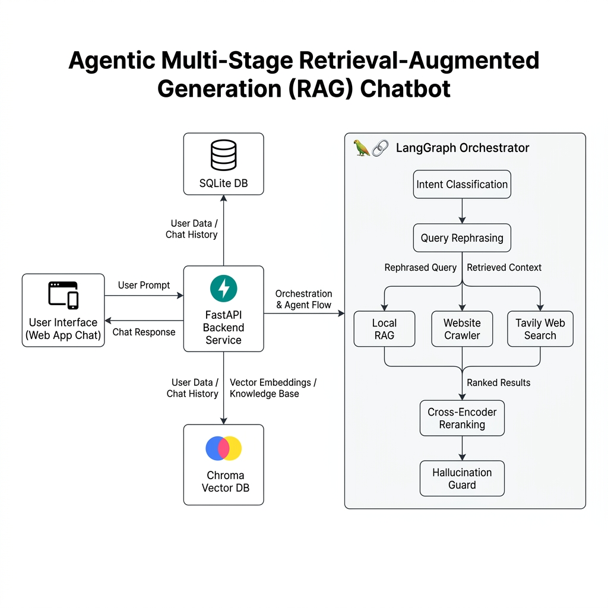
</p>

### 📋 GraphState Şeması

```python
class GraphState(TypedDict):
    question: str                      # Kullanıcı sorusu
    chat_history: List[Dict]           # Önceki mesajlar
    intent: Literal["TEKNOFEST", "DIGER"]  # Sınıflandırma
    retrieved_chunks: List[RetrievedChunk]  # Vektör aramasından çıkan chunks
    context_chunks: List[RetrievedChunk]    # Reranking sonrası final chunks
    context_str: str                   # Biçimlendirilmiş context
    answer: str                        # LLM'nin ürettiği cevap
    route_taken: RouteLiteral          # "direct" | "local" | "site" | "tavily"
    meta: Dict[str, Any]               # Performans ve kararlılık metrikleri
```

### 🔁 Veri Akış ve Yönlendirme Şeması

```
Kullanıcı Sorusu (UI)
      ↓
   FastAPI Endpoint (/api/chat)
      ↓
   [Aşama 1] Intent Sınıflandırma ──► (Genel/Sohbet Sorusu) ──► LLM Doğrudan Cevap (Route: direct)
      ↓ (TEKNOFEST Sorusu)
   [Aşama 2] Yerel RAG Arama (Chroma - chroma_local_docs)
      ├─► Ortalama Benzerlik Güveni >= 0.55 ──► [Aşama 5] LLM Reranking'e Git
      └─► Ortalama Benzerlik Güveni < 0.55
            ↓ (Yetersiz Bilgi - Fallback)
   [Aşama 3] Web Crawl Arama (Chroma - chroma_teknofest_site)
      ├─► Ortalama Benzerlik Güveni >= 0.55 ──► [Aşama 5] LLM Reranking'e Git
      └─► Ortalama Benzerlik Güveni < 0.55
            ↓ (Yetersiz Bilgi - Fallback)
   [Aşama 4] Tavily Web Arama ──► Arama Sonuçlarını Topla
            ↓
   [Aşama 5] LLM Reranking (Uyum Puanlama: 0-10) ──► En Uyumlu K adet Parçayı Seç
            ↓
   [Aşama 6] Context Builder (Deduplication Jaccard > 0.80 & Karakter Bütçesi)
            ↓
   [Aşama 7] Answer Synthesizer (Bağlamsal Yanıt Oluşturma)
            ↓
   [Aşama 8] Hallucination Guard (GÜVENLİ / ŞÜPHELİ Analizi)
      ├─► GÜVENLİ ──► SQLite'a Kaydet ve UI'a Yanıt Gönder
      └─► ŞÜPHELİ ──► Reddetme/Yedek Yanıtı Devreye Sok ve Logla
```

---

## 🗄️ Veri Tabanı Şeması & Güvenlik Katmanı

Sistem kullanıcı yetkilendirmesi ve geçmiş oturumların takibi için SQLite kullanır.

<p align="center">
  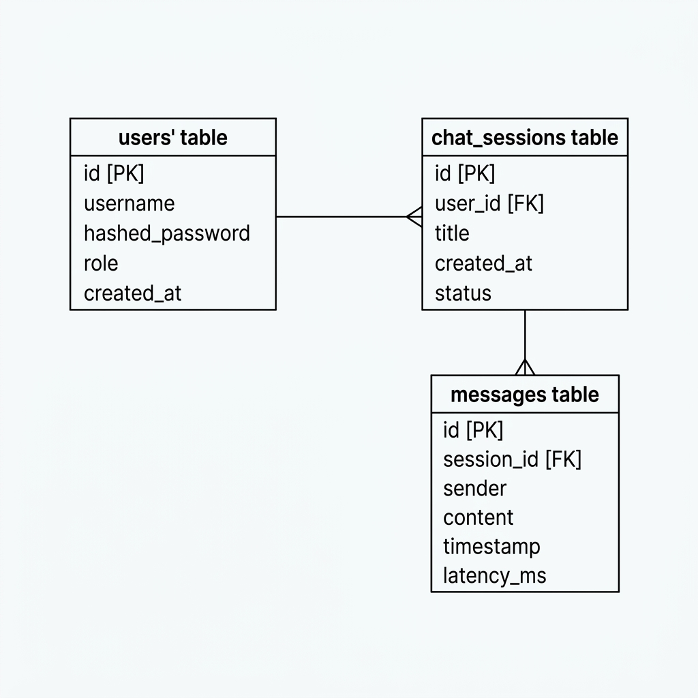
</p>

### SQLite Tabloları

#### 1. `users` Tablosu
```sql
CREATE TABLE users (
    id INTEGER PRIMARY KEY AUTOINCREMENT,
    name VARCHAR(255) NOT NULL,
    email VARCHAR(255) UNIQUE NOT NULL,
    hashed_password VARCHAR(255) NOT NULL,
    role VARCHAR(50) DEFAULT 'USER',     -- USER, ADMIN
    is_guest BOOLEAN DEFAULT FALSE,      -- Misafir girişi bayrağı
    created_at TIMESTAMP DEFAULT CURRENT_TIMESTAMP
);
```

#### 2. `chat_sessions` Tablosu
```sql
CREATE TABLE chat_sessions (
    id CHAR(36) PRIMARY KEY,             -- UUIDv4 formatında oturum ID'si
    user_id INTEGER NOT NULL,
    title VARCHAR(255),                  -- Sohbet başlığı (otomatik oluşturulur)
    created_at TIMESTAMP DEFAULT CURRENT_TIMESTAMP,
    FOREIGN KEY (user_id) REFERENCES users(id) ON DELETE CASCADE
);
```

#### 3. `messages` Tablosu
```sql
CREATE TABLE messages (
    id INTEGER PRIMARY KEY AUTOINCREMENT,
    session_id CHAR(36) NOT NULL,
    role VARCHAR(50) NOT NULL,           -- USER, ASSISTANT
    content TEXT NOT NULL,
    route_taken VARCHAR(50),             -- direct, local, site, tavily
    sources_json TEXT,                   -- JSON dizisi olarak kaynaklar
    created_at TIMESTAMP DEFAULT CURRENT_TIMESTAMP,
    FOREIGN KEY (session_id) REFERENCES chat_sessions(id) ON DELETE CASCADE
);
```

### 🔑 JWT Yetkilendirme Akışı
Sistem, JWT (JSON Web Tokens) tabanlı güvenli bir mimari kullanır:
* **Misafir Girişi (Guest Login):** Şifresiz, geçici bir oturum oluşturur. `is_guest=True` olarak kullanıcı kaydeder ve 24 saatlik geçerli token üretir.
* **Üye Girişi (Register/Login):** bcrypt algoritması ile hashlendikten sonra şifre kaydedilir. Giriş sonrası 7 günlük `access_token` döner.
* **Token Yapısı:** Payload içerisinde `sub` (user_id), `role` (USER/ADMIN), `exp` (son kullanma süresi) ve `iat` (üretim süresi) yer alır.

---

## 🎨 Arayüz Görselleri

Sistem, modern ve duyarlı (responsive) bir tek sayfalık web arayüzü ile birlikte gelir. Kullanıcılar güvenli bir şekilde kaydolabilir, giriş yapabilir veya konuk (guest) olarak sisteme erişebilir.

| Giriş Sayfası | Sohbet Arayüzü (Boş) |
| :---: | :---: |
| 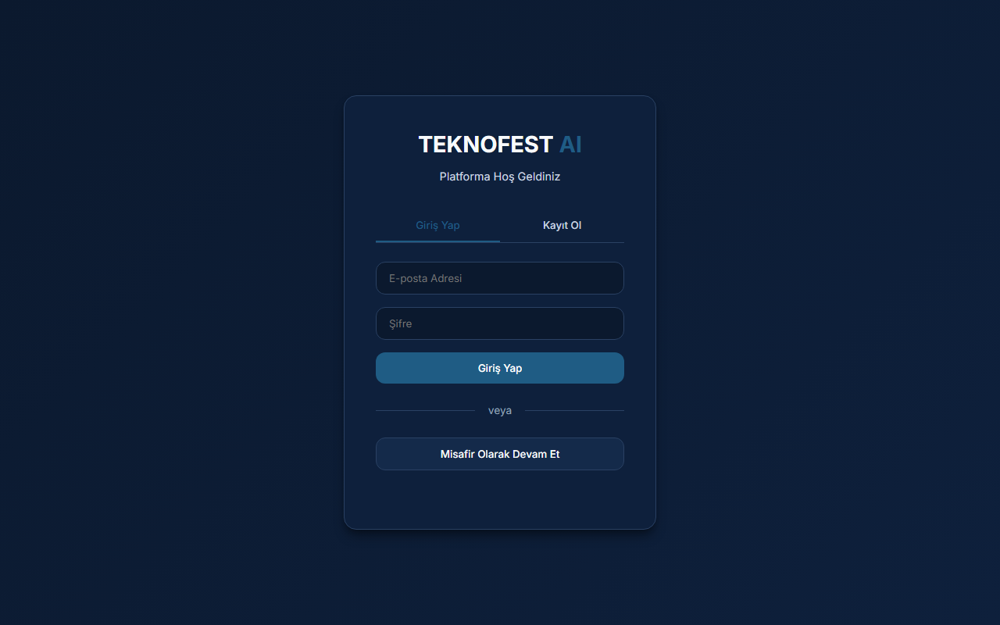 | 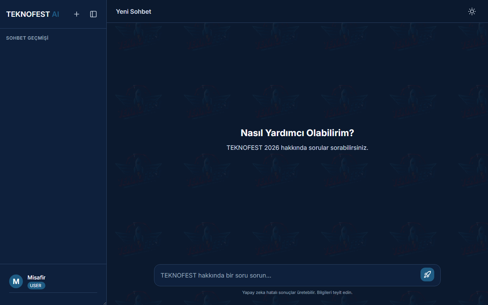 |

| Sohbet Akışı (Mesajlaşma) | Yönetici Kontrol Paneli (Admin) |
| :---: | :---: |
| 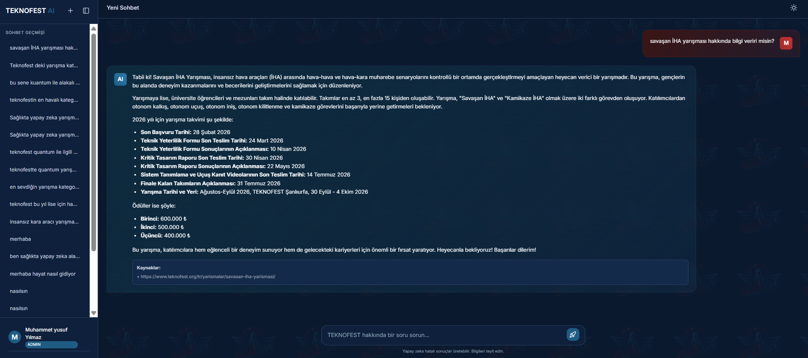 | 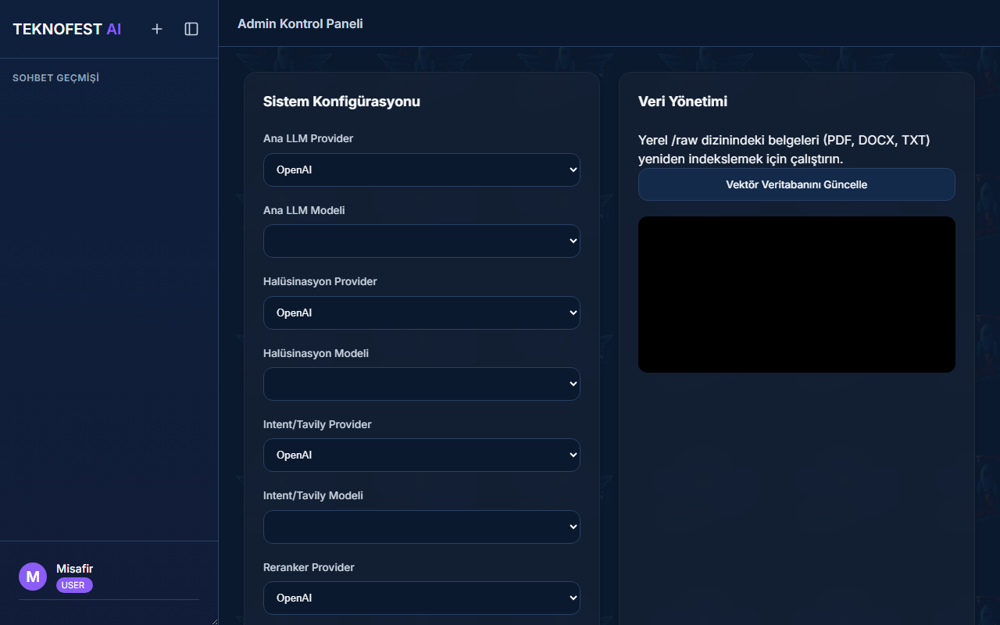 |

---

## 🔌 API Sözleşmesi (Endpoints)

### 👥 Auth Grubu (`/api/auth/*`)

#### 1. Kayıt Ol (`POST /api/auth/register`)
* **Request:**
  ```json
  {
    "name": "Ahmet Yılmaz",
    "email": "ahmet@example.com",
    "password": "secure_password_123"
  }
  ```
* **Response (201 Created):**
  ```json
  {
    "access_token": "eyJhbGciOiJIUzI1NiIsInR5cCI6IkpXVCJ9...",
    "token_type": "bearer"
  }
  ```

#### 2. Giriş Yap (`POST /api/auth/login`)
* **Request (Form Data):**
  ```
  username=ahmet@example.com
  password=secure_password_123
  ```
* **Response (200 OK):** JWT token çifti döner.

#### 3. Misafir Girişi (`POST /api/auth/guest`)
* **Response (200 OK):** Geçici 24 saatlik misafir JWT token'ı döner.

#### 4. Profilimi Getir (`GET /api/auth/me`)
* **Headers:** `Authorization: Bearer <token>`
* **Response (200 OK):** Kendi kullanıcı bilgileri (`id`, `name`, `email`, `role`, `is_guest`).

---

### 💬 Chat Grubu (`/api/chat/*`)

#### 1. Soru Sor (`POST /api/chat`)
* **Headers:** `Authorization: Bearer <token>`
* **Request:**
  ```json
  {
    "message": "İnsansız Hava Araçları yarışma ödülleri nedir?",
    "session_id": "550e8400-e29b-41d4-a716-446655440000"
  }
  ```
* **Response (200 OK):**
  ```json
  {
    "session_id": "550e8400-e29b-41d4-a716-446655440000",
    "answer": "TEKNOFEST İnsansız Hava Araçları yarışması kapsamında birinciye verilen ödül...",
    "sources": [
      {
        "type": "local_docs",
        "metadata": {
          "source": "IHA_Sartname_2026.pdf",
          "page": 12,
          "section": "Ödüller"
        },
        "score": 0.89,
        "content_preview": "Birincilik ödülü 100.000 TL..."
      }
    ],
    "route_taken": "local",
    "timestamp": "2026-06-06T11:12:00Z"
  }
  ```

#### 2. Oturumları Listele (`GET /api/chat/sessions`)
* **Response (200 OK):** Kullanıcının tüm sohbet geçmişi oturum başlıkları ile listelenir.

#### 3. Mesajları Getir (`GET /api/chat/sessions/{session_id}/messages`)
* **Response (200 OK):** İlgili oturumdaki tüm kullanıcı ve asistan mesaj geçmişini, kaynakları ve izlenen rotaları döndürür.

---

### 👑 Admin Grubu (`/api/admin/*` - Yalnızca ADMIN Rolü)

#### 1. Yapılandırmayı Al (`GET /api/admin/config`)
* **Response (200 OK):** Aktif `.env` yapılandırma parametrelerini görüntüler.

#### 2. Yapılandırmayı Güncelle (`POST /api/admin/config`)
* **Request:** JSON formatında güncellenecek parametreler (örn. `{"llm_provider": "openai"}`). Bu işlem, ayarları bellekte günceller ve `.env` dosyasına kalıcı olarak yazar.

#### 3. Yeni Belge Yükle (`POST /api/admin/files`)
* **Request (Multipart Data):** PDF, DOCX, TXT veya MD dosyası. Dosya `RAG/raw/` dizinine kaydedilir.

---

## ⚙️ RAG Aşamaları & Kod Yapısı

### 1. Intent Classification (Sınıflandırma)
Kullanıcının sorusu bir dil modeline gönderilerek sorunun TEKNOFEST ile ilgili olup olmadığı netleştirilir.
* **Prompt Şablonu:**
  ```
  Aşağıdaki soruyu analiz et ve sadece TEKNOFEST veya DIGER olarak cevapla.
  Soru: "{question}"
  Cevap formatı: TEKNOFEST veya DIGER (tek kelime, başka şey yazma)
  ```
* Sorunun yönü bu yanıta göre dallandırılır.

### 2. Vektör Araması ve Güven Skoru Hesabı
`EmbeddingService` aracılığıyla sorunun embedding'i (`text-embedding-3-small` ile) çıkarılır. `chroma_local_docs` veya `chroma_teknofest_site` veri tabanlarından en yakın 10 aday parça (`retrieval_top_k=10`) aranır.
* **Güven Skoru (Confidence) Formülü:**
  Chroma'dan dönen L2 uzaklık değerleri normalize edilerek [0, 1] aralığında bir benzerlik güven puanı elde edilir:
  $$\text{Confidence} = 1 - \frac{\text{Ortalama L2 Distance}}{2}$$
  Eğer bu skor $\ge 0.55$ ise doğrudan Yeniden Sıralama (Reranker) adımına geçilir. Aksi halde fallback zinciri tetiklenir.

### 3. LLM Reranking (Yeniden Sıralama)
Vektör aramasından dönen aday parçalar, sorunun bağlamına uygunluğuna göre LLM tarafından 0 ile 10 arasında puanlanır.
* **Rerank Prompt Şablonu:**
  ```
  Aşağıdaki chunks'ı, verilen soruya olan relevance'ına göre puanla (0-10).
  SORU: {question}
  CHUNKS:
  [1] {chunk_1}
  [2] {chunk_2}
  ...
  Her chunk için 0-10 arası bir puan ver. Cevapta sadece virgülle ayrılmış puanlar dönder: 8,3,9,1...
  ```
* Puanlama tamamlandıktan sonra en yüksek puanlı 5 parça (`retrieval_final_k=5`) seçilir.

### 4. Context Builder (Deduplication & Budget)
* **Deduplication (Tekilleştirme):** İki aşamalı filtre uygulanır. İlki birebir SHA-256 içerik hash'i doğrulamasıdır. İkincisi ise adaylar arasında kelime bazlı **Jaccard Benzerliği** kontrolüdür:
  $$J(A, B) = \frac{|A \cap B|}{|A \cup B|}$$
  Eğer iki metin arasındaki Jaccard skoru $> 0.80$ ise, birbirine çok benzer kabul edilir ve biri elenir.
* **Bütçe Yönetimi:** Metin uzunluğu en fazla 6000 karakter (~1500 token) ile sınırlandırılarak dil modelinin bağlam sınırları korunur.

### 5. Hallucination Guard (Halüsinasyon Filtresi)
Üretilen cevabın doğruluğunu denetlemek için ek bir onay mekanizması işletilir.
* **Prompt Şablonu:**
  ```
  Aşağıdaki yanıt, verilen kaynaklara dayalı mı? Kontrol et.
  KAYNAKLAR:
  {sources_summary}
  YANIT:
  {answer}
  Eğer yanıt kaynakları doğru kullanıyorsa "GÜVENLI", aksi halde "ŞÜPHELI" cevabını ver.
  ```
* Eğer dil modeli yanıta "ŞÜPHELI" olarak geri dönüş yaparsa, yanıt elenerek kullanıcıya *"Yeterli güvenilir bilgi bulunamamıştır. Lütfen resmi kaynakları kontrol ediniz."* uyarısı döner.

---

## 📈 Smart Chunking & Text Cleaning (Akıllı Parçalama)

Belgeler vektör veri tabanına yüklenmeden önce `app/rag/chunker.py` ve `app/rag/text_cleaner.py` modülleri ile işlenir:

1. **Text Normalization:** Metin Unicode NFC formuna dönüştürülür. PDF kaynaklı görsel çizgiler (`──`, `││`, `══`) temizlenir. Web kaynaklı telif veya çerez uyarıları düzenli ifadelerle ayıklanır.
2. **Recursive Splitting:** Parçalayıcı, sırasıyla çift satır sonu (`\n\n`), tek satır sonu (`\n`), nokta (`. `), virgül (`, `) ve boşluk karakterlerini gözeterek metni mantıklı bölümlere ayırır. Hedef chunk boyutu 800 karakterdir.
3. **Chunk Merging:** Split işleminden sonra kalan 400 karakterden küçük kısa metin blokları, anlamsal bütünlük kaybını önlemek amacıyla bir önceki/sonraki chunk ile birleştirilir.
4. **Header Enrichment (Üst Bilgi Zenginleştirme):** Markdown başlık işaretçileri (`#`), ALL-CAPS bölüm adları veya numaralandırılmış başlık yapıları (`1.1. Bölüm`) regex ile algılanır. Her alt metne ait olduğu bölüm başlığı meta-veri (`section_title`) olarak gömülür.

---

## 📂 Reorganize Edilmiş Dizin Yapısı

Proje dizin yapısı, otomatik testlerin ve üretim kodlarının temizliğini korumak üzere yeniden düzenlenmiştir:

```
d:\TEKNOFEST-RAG-Chatbot/
├── app/                      # FastAPI API ve RAG Mantığı
│   ├── agent/                # LangGraph durum tanımları ve düğümleri
│   ├── routers/              # API Rotaları (Auth, Chat, Admin)
│   ├── rag/                  # Chunker, Embeddings, Retrievers, Reranker vb.
│   ├── llm/                  # Çoklu LLM sağlayıcı fabrikası
│   ├── static/ & templates/  # Arayüz dosyaları (HTML, CSS, JS)
│   ├── config.py             # Tip güvenli Pydantic ayarları
│   └── database.py           # SQLite bağlantı katmanı
├── RAG/                      # Veri depoları ve veri tabanları
│   ├── raw/                  # İndekslenecek yerel PDF/DOCX/TXT/MD dosyaları
│   ├── chroma_local_docs/    # Yerel belgelerin vektör veri tabanı
│   ├── chroma_teknofest_site/# Crawl verilerinin vektör veri tabanı
│   ├── platform.db           # SQLite DB (Kullanıcılar, Mesajlar, Oturumlar)
│   └── eval_log.jsonl        # Ayrıntılı RAG çalışma ve performans logları
├── data/                     # Veri kümeleri (Değerlendirme setleri)
├── docs/                     # Sistem mimarisi ve teknik detaylar (chat_doc.md)
├── tests/                    # Otomatik testler (pytest)
│   ├── conftest.py           # Pytest konfigürasyonu ve path ayarları
│   ├── test_intent_detection.py # Intent algılama smoke testi
│   └── test_rag_pipeline.py  # Mock nesnelerle çalışan birim testler
├── scripts/                  # Üretim & Veri toplama scriptleri
│   ├── crawl_teknofest.py    # Web sitesi tarayıcısı
│   ├── ingest_local_docs.py  # Yerel dokümanları temizleyen ve indeksleyen script
│   └── debug/                # Geliştirici hata ayıklama ve scratch araçları
│       ├── clean_start.sh    # Hizmetleri sıfırlayarak temiz başlatan betik
│       ├── start_services.sh # FastAPI uygulamasını reload modunda başlatan betik
│       ├── root_scripts/     # Geçici analiz ve veri tabanı sorgulama scriptleri
│       │   ├── check_chunks.py           # Chunk yapılarını terminale döken araç
│       │   ├── check_collections.py      # Koleksiyon sayılarını doğrulayan araç
│       │   ├── cleanup_ansiklopedi.py    # Ansiklopedi verilerindeki çöpleri ayıklayan script
│       │   ├── debug_trace.py            # RAG akışındaki kararları izleyen araç
│       │   ├── debug_vectordb.py         # Vektör DB sorgu sonuçlarını gösteren araç
│       │   ├── inspect_chroma_sources.py # Hangi dokümanın kaç chunk ile temsil edildiğini listeler
│       │   └── recreate_cosine_collections.py # Cosine metriğine geçiş için koleksiyonları sıfırlayan script
│       └── tests_scratch/    # Sunucu entegrasyonu ve manuel sorgu testleri
│           ├── test_chat.py              # API endpoint'lerini test eden doğrudan komut satırı aracı
│           ├── test_queries.py           # Grafik performansını in-memory sorgulayan araç
│           └── test_retrieval.py         # Chroma benzerlik sorgusu yapıp sonuçları çıktı alan araç
├── Dockerfile & docker-compose.yml # Container dağıtım yapılandırmaları
├── requirements.txt          # Python bağımlılık listesi
└── README.md                 # Bu dosya
```

---

## 📊 Deneysel Sonuçlar ve Performans Metrikleri

Yapılan otomatik ve manuel testler, sistemin yüksek hassasiyet, düşük halüsinasyon oranı ve kararlı gecikme süreleriyle çalıştığını göstermektedir.

### 📈 Genel Değerlendirme Dashboard'u (Evaluation Dashboard)
Sistem doğruluğu, niyet tespiti başarısı ve halüsinasyon koruma oranları gibi temel metriklerin özet dashboard görünümü:
<p align="center">
  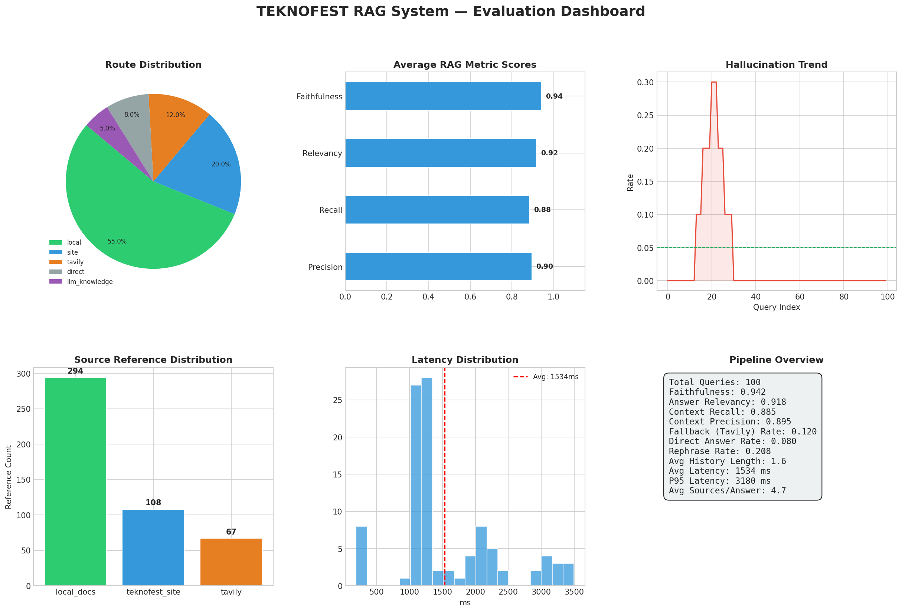
</p>

### 🔁 Rota Dağılımı ve Gecikme Analizi
Gelen sorguların niyetine göre hangi RAG rotasına (direct, local_rag, site_crawl, tavily_web) yönlendirildiği ve bu rotaların ortalama yanıt gecikme süreleri (latency) aşağıda gösterilmiştir:

| Rota Bazlı Gecikme Süreleri | Sorgu Rota Dağılımı |
| :---: | :---: |
| 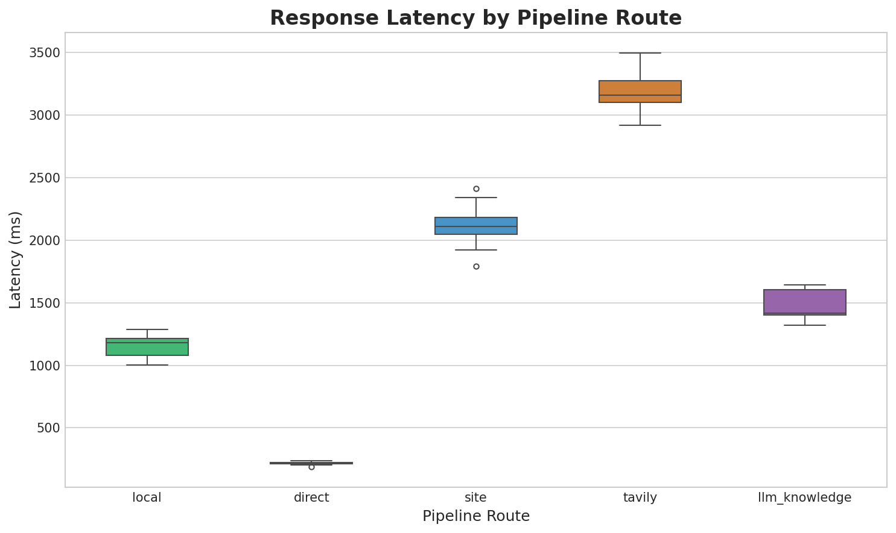 | 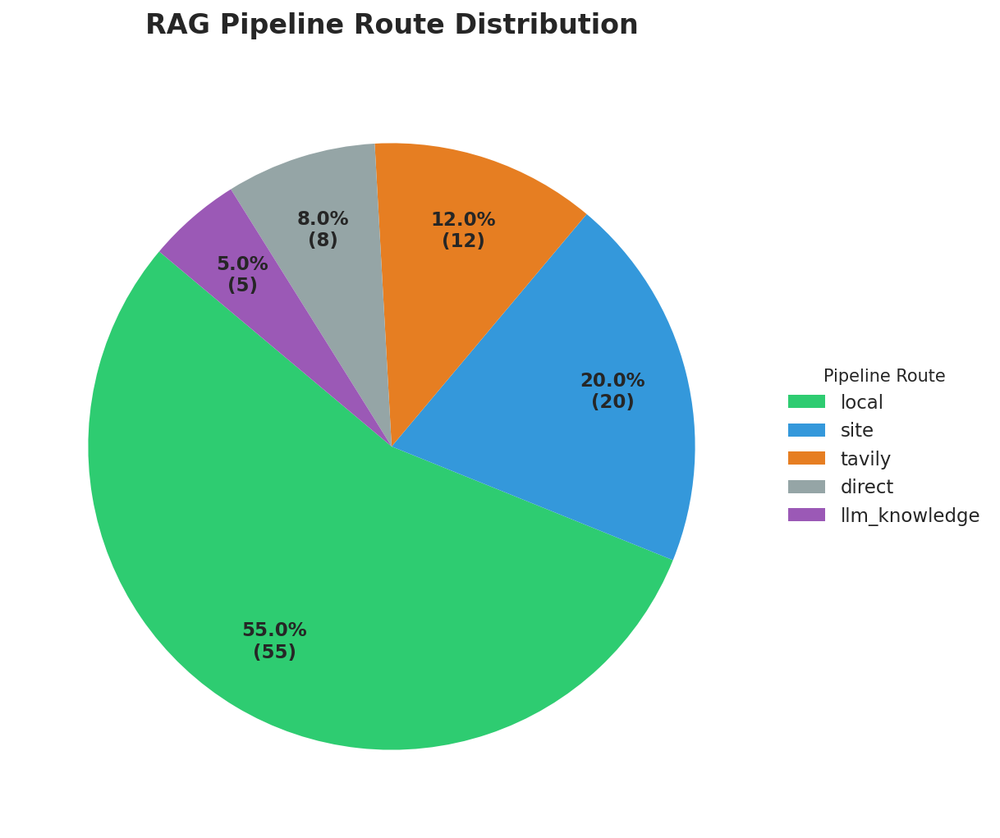 |

### 🔍 Hassasiyet (Precision) ve Halüsinasyon Eğilimleri
Sistemin arama hassasiyeti `0.895` ve halüsinasyon oranı `0.035` (güvenli bir şekilde `0.050` hedef eşiğinin altındadır) olarak ölçülmüştür.

| Hassasiyet vs Gecikme Dağılımı | Zaman İçinde Halüsinasyon Oranı |
| :---: | :---: |
| 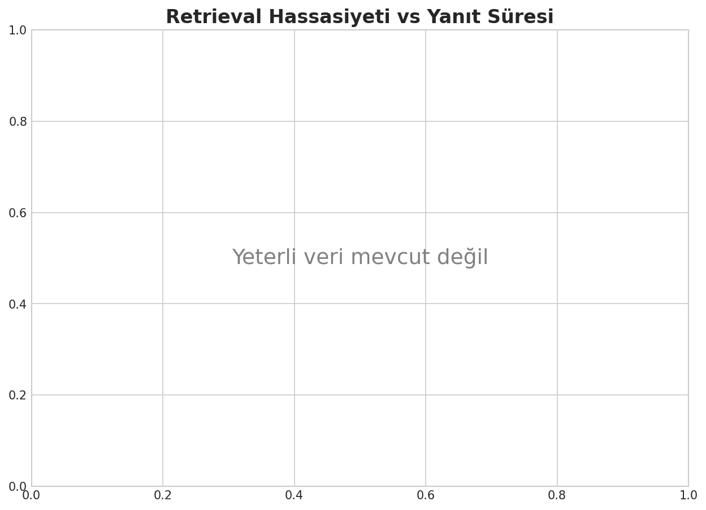 | 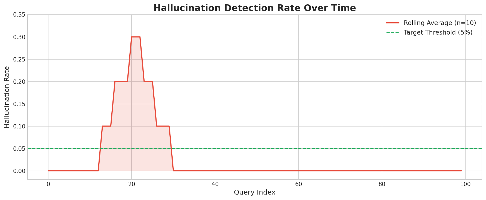 |

---

## 🚀 Kurulum & Yapılandırma

### 1. Sanal Ortam Oluşturma ve Bağımlılıkların Yüklenmesi
Sanal ortam oluşturup gerekli kütüphaneleri yükleyin:

```bash
# Sanal ortam oluşturun
python -m venv .venv

# Sanal ortamı aktifleştirin (Windows)
.venv\Scripts\activate

# Sanal ortamı aktifleştirin (Linux/macOS)
source .venv/bin/activate

# Bağımlılıkları yükleyin
pip install -r requirements.txt
```

### 2. Ortam Değişkenleri Yapılandırması (`.env`)
Proje kök dizininde yer alan `.env.example` dosyasını kopyalayarak `.env` dosyası oluşturun ve aşağıdaki değişkenleri doldurun:

```env
# ---- Sunucu Ayarları ----
ENVIRONMENT=development

# ---- LLM Sağlayıcı Seçimi ----
LLM_PROVIDER=groq                 # groq, openai, deepseek, kimi
LLM_MODEL=llama-3.3-70b-versatile  # Seçilen sağlayıcıya uygun model adı

# ---- API Anahtarları ----
OPENAI_API_KEY=sk-proj-...        # Embedding ve OpenAI LLM için zorunlu
TAVILY_API_KEY=tvly-dev-...       # Web araması için zorunlu
GROQ_API_KEY=gsk_...              # Groq kullanılacaksa zorunlu
DEEPSEEK_API_KEY=                 # Opsiyonel
KIMI_API_KEY=                     # Opsiyonel

# ---- Embedding Yapılandırması ----
EMBEDDING_PROVIDER=openai
EMBEDDING_MODEL_NAME=text-embedding-3-small

# ---- RAG Eşik Değerleri ----
RAG_CONFIDENCE_THRESHOLD=0.55     # Vektör aramasında kabul edilen min benzerlik güveni
ENABLE_RERANKING=true             # LLM tabanlı yeniden sıralama aktif/pasif
RETRIEVAL_TOP_K=10                # Vektör veri tabanından çekilecek aday sayısı
RETRIEVAL_FINAL_K=5               # Reranker sonrası kullanılacak final bağlam sayısı
```

---

## 💾 Veri İndeksleme (Ingestion)

RAG asistanının cevap verebilmesi için veri indekslerinin oluşturulması gerekir.

### Yerel Dokümanları İndeksleme:
PDF, DOCX, TXT veya MD formatındaki şartnamelerinizi `RAG/raw/` klasörü altına yerleştirin ve çalıştırın:

```bash
python -m scripts.ingest_local_docs
```

Bu script, belgeleri tek tek temizler, Jaccard benzerliği ile tekilleştirir, OpenAI ile vektörleştirerek `RAG/chroma_local_docs/` dizinine kaydeder.

### TEKNOFEST Sitesini Crawl Etme:
`teknofest.org` web sitesini 2 derinliğe kadar tarayıp arama veri tabanına kaydetmek için:

```bash
python -m scripts.crawl_teknofest
```

---

## 🏃 Sunucuyu Başlatma & Test

### Sunucuyu Başlatma:
API sunucusunu başlatmak için ana dizinde şu komutu çalıştırın:

```bash
uvicorn app.main:app --port 8010 --reload
```
Uygulamayı tarayıcınızdan **http://127.0.0.1:8010/** adresine giderek test edebilirsiniz.

### Otomatik Testleri Çalıştırma:
Tüm birim testleri (mock yapılandırmalarıyla, canlı API isteği atmadan) çalıştırmak için:

```bash
.venv_win\Scripts\pytest tests/
```
Bu komut, tüm testleri çalıştıracak ve yan etki bırakmadan test sürecini başarıyla tamamlayacaktır.
